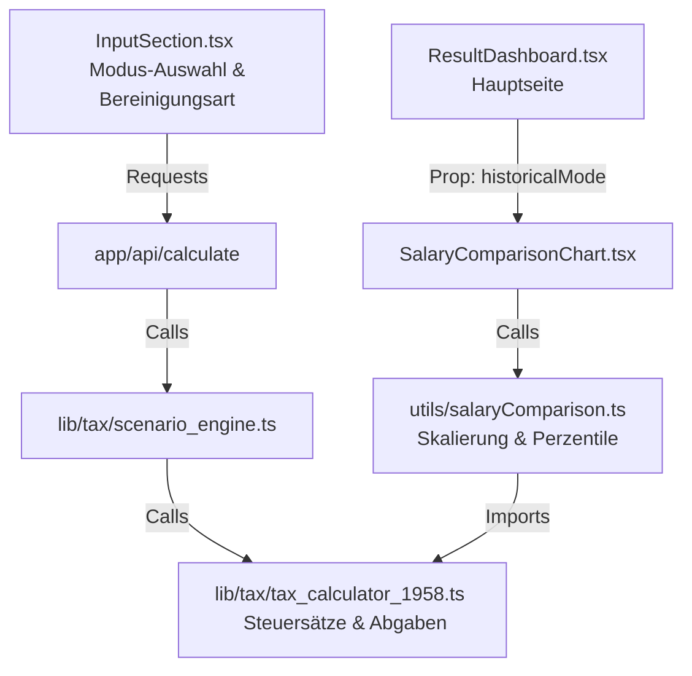

# Technisches Konzept: Historisches Steuerszenario & Gehaltsvergleich (1958 vs. 2026)

Dieses Dokument dokumentiert die mathematischen Grundlagen, historischen Daten und die Code-Architektur für das historische Steuerszenario (Tarif und Sozialabgaben von 1958) sowie den historischen Gehaltsvergleich.

---

## 1. Fachlicher Hintergrund

Ziel des Features ist es, das heutige Steuersystem (2026) mit dem historischen System der Bundesrepublik Deutschland des Jahres 1958 (dem Geburtsjahr des modernen Einkommensteuertarifs und des Ehegattensplittings) zu vergleichen. 

Es stützt sich auf die Veröffentlichungen von Steuerfachmann Günter Striewe (Süddeutsche Zeitung, Mai 2026) und unterscheidet zwei wesentliche Bereinigungsarten:

1. **Lohnbereinigt (Relativer Lebensstandard):** Vergleicht die relative Position des Nutzers in der Gesellschaft. Das heutige Einkommen wird proportional zur Entwicklung des Durchschnittsentgelts der gesetzlichen Rentenversicherung (51.944 € in 2026 vs. 5.330 DM in 1958) herabgesetzt.
2. **Preisbereinigt (Kaufkraft):** Vergleicht die reine materielle Kaufkraft. Das heutige Einkommen wird anhand der kumulierten Inflation laut Bundesbank (1 DM 1958 $\approx$ 2,86 € heute) umgerechnet.

---

## 2. Mathematische Grundlagen & Tarif 1958

### A. Einkommensteuertarif 1958 (§ 32a EStG)
Die Steuersätze werden in D-Mark (DM) berechnet und anschließend zum offiziellen Wechselkurs ($1\text{ EUR} = 1,95583\text{ DM}$) konvertiert.

Für das zu versteuernde Einkommen ($zvE$) in DM gilt folgende Formel:

1. **Zone 1 (Grundfreibetrag):** $zvE \le 1.680\text{ DM} \Rightarrow ESt = 0$
2. **Zone 2 (Proportionalzone / Eingangssteuersatz):** $1.681\text{ DM} \le zvE \le 8.009\text{ DM}$
   $$ESt = 0,20 \times (zvE - 1.680)$$
3. **Zone 3 (Progressionszone I):** $8.010\text{ DM} \le zvE \le 23.999\text{ DM}$
   $$Y = \frac{zvE - 8.000}{1.000}$$
   $$ESt = 1.264 + 272 \times Y + 2,9 \times Y^2$$
4. **Zone 4 (Progressionszone II):** $24.000\text{ DM} \le zvE \le 110.039\text{ DM}$
   $$Y = \frac{zvE - 24.000}{1.000}$$
   $$ESt = 6.358 + 382 \times Y + 1,572 \times Y^2 - 0,006 \times Y^3$$
5. **Zone 5 (Spitzensteuerbereich):** $zvE \ge 110.040\text{ DM}$
   $$ESt = 0,53 \times zvE - 11.281$$

#### Ehegattensplitting
Für gemeinsam veranlagte Ehepartner (Steuerklasse 3, 4, 5) gilt:
$$ESt_{joint}(zvE) = 2 \times ESt_{single}\left(\frac{zvE}{2}\right)$$

### B. Sozialabgaben 1958 (Arbeitnehmeranteil)
* **Rentenversicherung (RV):** 7,0 % (Beitragsbemessungsgrenze: 9.000 DM p.a.)
* **Arbeitslosenversicherung (AV):** 0,5 % (Beitragsbemessungsgrenze: 9.000 DM p.a.)
* **Krankenversicherung (KV):** 3,25 % (Beitragsbemessungsgrenze: 6.750 DM p.a.)
* **Pflegeversicherung (PV):** 0,0 % (nicht existent in 1958)

### C. Pauschbeträge 1958
* **Werbungskosten-Pauschbetrag:** 564 DM p.a.
* **Sonderausgaben-Pauschbetrag:** 36 DM p.a.

---

## 3. Historischer Gehaltsvergleich (Einkommensverteilung)

Um den Nutzer im Gehaltsvergleichs-Chart gegenüber der damaligen Bevölkerung einzuordnen, verwenden wir historische Einkommensstatistiken des Statistischen Bundesamtes für das Jahr 1958:

### A. Gehaltsstatistiken 1958 (BRD, alte Bundesländer)
* **Durchschnittliches Entgelt (Rentenversicherung):** 5.330 DM / Jahr
* **Monatlicher Bruttolohn vollzeitbeschäftigter Arbeitnehmer (Destatis):**
  * Gesamt: ~227 DM/Monat (entspricht ~2.724 DM/Jahr)
  * Männer: ~261 DM/Monat (entspricht ~3.132 DM/Jahr)
  * Frauen: ~153 DM/Monat (entspricht ~1.836 DM/Jahr)

### B. Extrapolierte Median-Ankerwerte 1958
Wir setzen das Rentenversicherung-Durchschnittsentgelt (5.330 DM) als allgemeines Mittel an und passen die Geschlechterwerte anhand der Destatis-Ratios an (wobei wir davon ausgehen, dass der Median ca. 87,5 % des arithmetischen Mittels beträgt):
* **Median Gesamt:** $5.330\text{ DM} \times 0,875 \approx \mathbf{4.660\text{ DM / Jahr}}$
* **Median Männer:** $\left(5.330\text{ DM} \times \frac{261}{227}\right) \times 0,875 \approx \mathbf{5.360\text{ DM / Jahr}}$
* **Median Frauen:** $\left(5.330\text{ DM} \times \frac{153}{227}\right) \times 0,875 \approx \mathbf{3.140\text{ DM / Jahr}}$

### C. Skalierung auf 2026 EUR
Um die Kurven direkt im Chart mit dem 2026er Einkommen des Nutzers vergleichen zu können, werden die obigen 1958er Median-Ankerwerte mit dem jeweiligen Umrechnungsfaktor (`dmToEurFactor`) in 2026er Euro skaliert:
* **Lohnbereinigt (`mode === 'wage'`):** `dmToEurFactor = 51944 / 5330 ≈ 9.7456`
  * Median Gesamt: ~45.415 €
  * Median Männer: ~52.236 €
  * Median Frauen: ~30.601 €
* **Preisbereinigt (`mode === 'price'`):** `dmToEurFactor = 2,86`
  * Median Gesamt: ~13.328 €
  * Median Männer: ~15.330 €
  * Median Frauen: ~8.980 €

Die Altersverteilung (18–67 Jahre) wird durch die relative Alterskurve aus dem 2025er Modell abgebildet.

---

## 4. Code-Architektur & Dateien

### Relevante Quellcode-Dateien:
*   [tax_calculator_1958.ts](file:///Volumes/WD%20External%20Drive/lohnrechner/lib/tax/tax_calculator_1958.ts): Implementiert die gesamte mathematische Logik des 1958er Tarifs, der Sozialabgaben und die Skalierungsfaktoren.
*   [tax_calculator_1958.test.ts](file:///Volumes/WD%20External%20Drive/lohnrechner/lib/tax/__tests__/tax_calculator_1958.test.ts): Unit-Tests für alle Tarifzonen, Splitting und Sozialabgaben von 1958.
*   [scenario_engine.ts](file:///Volumes/WD%20External%20Drive/lohnrechner/lib/tax/scenario_engine.ts): Integriert die historische Berechnung in die API-Schnittstelle.
*   [salaryComparison.ts](file:///Volumes/WD%20External%20Drive/lohnrechner/utils/salaryComparison.ts): Berechnet die Gehaltspunkte und Perzentile für das Chart unter Einbeziehung des historischen Modus.
*   [SalaryComparisonChart.tsx](file:///Volumes/WD%20External%20Drive/lohnrechner/components/SalaryComparisonChart.tsx): Zeichnet das Gehaltsvergleichs-Chart und zeigt dynamische Texte und Achsenbeschriftungen.
*   [ResultDashboard.tsx](file:///Volumes/WD%20External%20Drive/lohnrechner/components/ResultDashboard.tsx): Verwaltet das Gesamtdesign und rendert die interaktive, ausklappbare Infobox.
